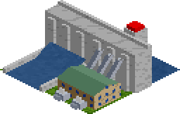
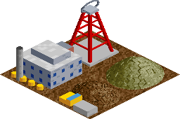
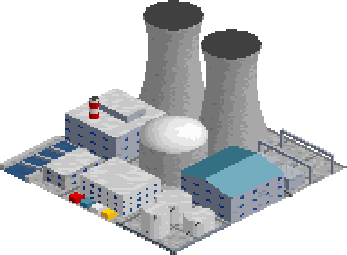
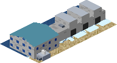
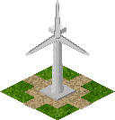
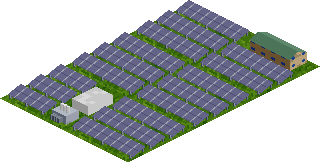
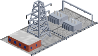
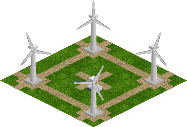

# Energy Transition Industries — OpenTTD Mod

<p align="center">
  
  
  
  
  
  
  
</p>

<p align="center">
  <a href="https://github.com/nathanpitman/Open-TTD-Renewable-Energy-Mod/releases/latest"><strong>⬇️ Download the latest release</strong></a>
</p>

Two components work together:
- `energy_transition.grf` — NewGRF adding 7 new industries and 2 custom cargos
- `energy_transition_gs/` — Game Script simulating an invisible power grid

## Compatibility

This mod is **likely incompatible with FIRS** (and other industry sets that replace the whole cargo and industry economy). FIRS defines its own set of cargos and industries, which can clash with the cargos and industries this mod adds or overrides. Expect missing or mislabelled cargos if both are active.

---

## Installation

### NewGRF
Copy `energy_transition.grf` to your OpenTTD `newgrf/` folder:
- **Windows**: `Documents\OpenTTD\newgrf\`
- **Mac**: `~/Documents/OpenTTD/newgrf/`
- **Linux**: `~/.local/share/openttd/newgrf/`

Enable in: **Main Menu → NewGRF Settings → Add**

### Game Script
Copy the `energy_transition_gs/` folder into your OpenTTD `game/` folder so the path is:
`game/energy_transition_gs/info.nut`

`game/` locations:
- **Windows**: `Documents\OpenTTD\game\`
- **Mac**: `~/Documents/OpenTTD/game/`
- **Linux**: `~/.local/share/openttd/game/`

Enable in: **Main Menu → AI/Game Script Settings → Game Script → select "Energy Transition Power Grid"**

> ⚠️ Do NOT place files in `content_download/` — that folder is managed by OpenTTD.
> Both the NewGRF and Game Script must be active **before starting a new game**.

---

## How it works

### Cargo chain
```
Energy Generators → [invisible grid] → Town growth
                  → Electrical Substation → (amplifies growth)
Uranium Mine → Uranium → Nuclear Power Plant → [invisible grid] → Town growth
```

### Invisible power grid (Game Script)
Every 30 days the script scans every town and finds all energy generators within `generator_radius` tiles. It sums their POWR production and sets the town's growth rate directly — no cargo transport needed.

| Power situation | Growth rate |
|---|---|
| No nearby power | Growth halted (configurable) |
| Low power | Very slow — 150 days/growth |
| Medium power | Moderate — 60 days/growth |
| Full power, no substation | Good — 30 days/growth |
| Full power + nearby substation | Fast — 12 days/growth |

### No deliveries needed
Hydro, tidal, wind and solar generators need nothing delivered: they make power as soon as they're built. Only the Nuclear Power Plant needs a supply chain. It makes exactly as much power as the uranium delivered to it.

### Energy timeline (all dates configurable)
| | Industry | Default era | Placement rule |
|---|---|---|---|
|  | Hydroelectric Dam | 1950 | Dam wall directly against water (river, lake or canal), facing whichever way the water is |
|  | Uranium Mine | 1953 | Remote |
|  | Nuclear Power Plant | 1956 | Requires Uranium delivery |
|  | Tidal Power Station | 1966 | Coast only |
|  | Wind Farm | 1980 | High ground only |
|  | Solar Farm | 1990 | Flat land only |
|  | Electrical Substation | 1950 | Near towns, amplifies growth |

### Coal phaseout

The vanilla Coal Power Station still needs coal deliveries. No new coal plants spawn after `param_coal_stop_year` (default 1970). Existing plants begin closing stochastically after `param_coal_close_year` (default 1990), accelerating 20 years later.

---

## NewGRF Parameters
Configure in **NewGRF Settings → select mod → Parameters** before starting a game.

**Era dates:** Hydro (1930–1960), Nuclear (1950–1975), Tidal (1960–1985), Wind (1970–1995), Solar (1980–2005), Coal stop (1960–1990), Coal close (1980–2020)

**Placement:** Wind min height (0–8), Substation spawn rate (1–10)

**Spawn rates:** Individual sliders for each generator type (0 = disabled)

**Debug:** Ignore all start-year limits (off by default; testing only — makes every generator and the uranium mine available from the start of the game)

## Game Script Parameters
Configure in **AI/Game Script Settings → select script → Configure**.

| Setting | Default | Description |
|---|---|---|
| Generator radius | 30 tiles | How far a generator powers nearby towns |
| Substation radius | 15 tiles | How far a substation amplifies growth |
| Min power threshold | 6 | POWR units/month needed for any growth |
| Full power threshold | 25 | POWR units/month for maximum growth |
| No power blocks growth | On | Towns with zero power cannot grow |
| Update interval | 30 days | How often the grid recalculates |

---

## Rebuilding from source
```bash
pip install nml pillow
python3 tools/make_sprites.py      # regenerate sprites/*.png and the NML spritesets
nmlc --grf=energy_transition.grf energy_transition.nml
python3 tools/ingame_check.py      # headless check in a real OpenTTD (needs openttd + openttd-opengfx)
```

### In-game check
`tools/ingame_check.py` loads the GRF and Game Script in a real OpenTTD with no screen: it generates a small map with every industry, runs a few game months, and checks that both cargos exist, every industry accepts and produces the right cargos, every generator produces power, the Nuclear Power Plant makes nothing without uranium, and the Game Script starts without errors. The checks live in a test-only Game Script, `tools/ingame_check_gs`. It can't see art, icons or animation, so still look at those in a real game.

### Sprites
All industry art is generated by `tools/make_sprites.py`, which renders each tile from simple 3D shapes. Edit the script, not the PNGs.

How the sprites should look is set out in [docs/sprite_design_spec.md](docs/sprite_design_spec.md). Follow it for any new or changed sprite.

- **Format:** 8bpp indexed PNG using OpenTTD's DOS palette, taken verbatim from `nml`. nmlc rejects any other palette, and in that palette index 0 (transparent) is stored as `(0,0,255)`.
- **Zoom:** 1x sheets are `sprites/<industry>.png` and 2x sheets are `sprites/<industry>_2x.png`. Both come from the same geometry and are wired up with `alternative_sprites(…, ZOOM_LEVEL_IN_2X, …)`.
- **One sprite per tile:** each sheet holds one sprite per distinct industry tile, so multi-tile industries read as a single site. Ground tiles are drawn separately in `sprites/ground.png` (grass, dirt, concrete, water, shore).
- **Cargo icons:** Power and Uranium have their own 10×10 icons (20×20 at 2x) in `sprites/cargo_icons.png` and `sprites/cargo_icons_2x.png`. They are flat pixel art with a dark outline like the base game's icons, drawn on a 10×10 grid so both zoom levels come from the same shapes.
- **Lighting:** as in original TTD art, the light comes from high up at the lower right of the screen ("4:30"; see the OpenTTD wiki's NewGRF *Recommended Standards*). Roofs are brightest, walls facing lower-right are lit and walls facing lower-left are shaded. `tools/compare_vanilla.py` shows this next to OpenGFX buildings. See section 4 of [the sprite design spec](docs/sprite_design_spec.md).
- **Wind turbine animation:** each turbine has `WIND_FRAMES` (8) rotor frames stepping the blades clockwise through 120°, which then loops. Frame 0 is the still image used for previews. The frames for one turbine sit together in `sprites/wind_farm.png`, so turbine *k*'s frame *f* is sprite `k * 8 + f`. The NML tile animation (`tile_wind_a`–`tile_wind_d`) must use the same frame count.
- **Animated colours:** water uses the palette-animated sea colours. The script sets the `ANIM` flag on any sprite that contains them.
- **Annotated references:** the script also writes `docs/sprites/<tile>.png`, an enlarged, labelled image of each sprite, and `docs/sprites/index.md`, which lists every part name (see `tools/sprite_refs.py`). Each drawing call sits inside `with cv.part("name"):`, which is where the labels come from. Wrap new drawing code the same way, or the build stops.
- **Offsets:** the script rewrites the block between `BEGIN/END GENERATED SPRITESETS` in `energy_transition.nml`, so sprite sizes and offsets always match the art.
- **Preview:** `python3 tools/preview.py preview.png [--scale 2]` assembles every industry the way the game lays it out, so you can check the art without starting OpenTTD. `python3 tools/preview.py --each docs/industries --scale 2 --zoom 1` writes the per-industry images used in this README. The single-turbine banner image (`docs/industries/wind_farm_single.png`) is the `wind_farm/single` layout in `tools/preview.py`, generated the same way via `compose("wind_farm/single", 2, bg=(0, 0, 0, 0))`.
- **Compare with vanilla:** `python3 tools/compare_vanilla.py [out.png] [--opengfx PATH]` draws our tiles next to similar vanilla OpenGFX buildings (cooling tower, power station, headframe, office block and more) on their own ground at 1x zoom. Use it to check lighting, scale and colour against the base game without starting it. It reads OpenGFX from your OpenTTD install, or from the path you give (`ogfx1_base.grf`, a folder containing it, or an OpenGFX `.tar`). OpenGFX is GPL-2.0, so the output image isn't committed; `vanilla_compare.png` is git-ignored.
